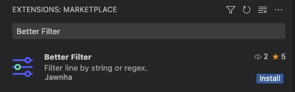

# VSCode Better Filter

Filter line by string or Regex.

## Features

1. Filter line by input string (or not contain input string).
2. Filter line by input regex (or not match input regex).

## Introduce

- [Github](https://github.com/smbera/vscode-better-filter)

## Install

1. [Marketplace](https://marketplace.visualstudio.com/items?itemName=Jawnha.vscode-better-filter)
2. Search `Better Filter` in vscode extensions.

## Usage

### Filter line by input string.

1. Open command palette (⇧⌘p) and type `Better Filter`, select command in the list.
2. Type a string or regex and hit `<Enter>`.

### Keyboard Shortcuts.

1. `"Better Filter: Include Lines with String"` - `"Alt + F" or "⌥ + F"`
